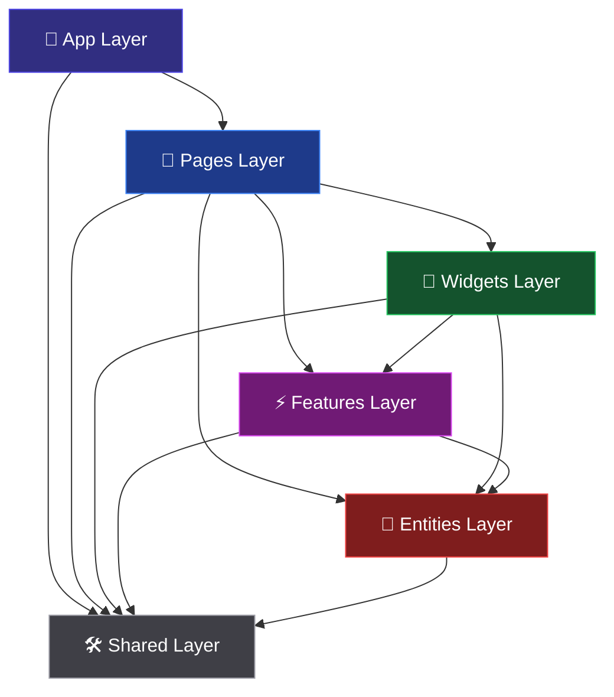
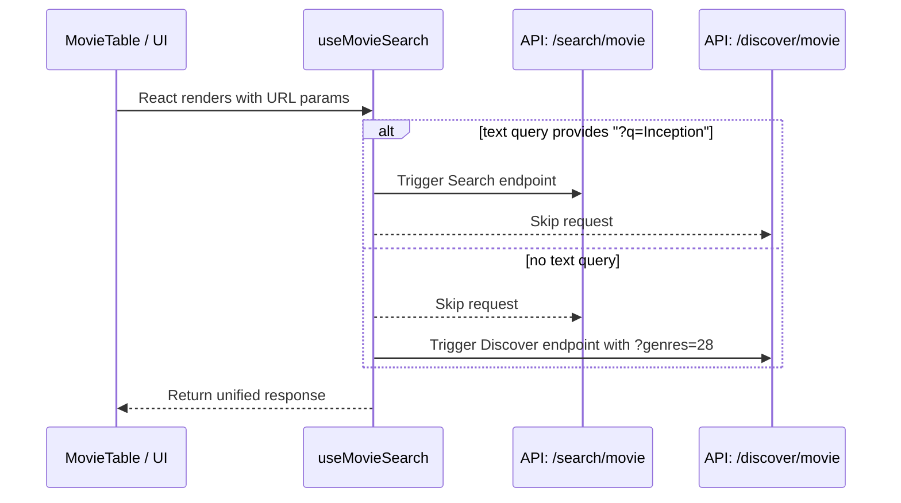

# 🎬 Talent Movie Explorer

[](https://vitejs.dev/)
[](https://reactjs.org/)
[](https://www.typescriptlang.org/)
[](https://redux.js.org/)
[](https://tailwindcss.com/)

A production-grade, highly scalable single-page application built to explore movies using the TMDB API. Engineered with a strict adherence to **Feature-Sliced Design (FSD)**, this project serves as a showcase of senior-level frontend architecture, state management patterns, and performance optimizations.

---

## 🏗 Architecture & Design Patterns

The codebase is strictly structured following the [Feature-Sliced Design (FSD)](https://feature-sliced.design/) methodology. FSD enforces unidirectional dependencies, ensuring that lower layers (e.g., `shared`, `entities`) never import from higher layers (e.g., `features`, `pages`). This prevents circular dependencies and highly decouples the UI components from business logic.

### Dependency Flow



### Layer Breakdown

- **`app/`**: Application-wide configurations, routing root (`RouterProvider`), and global providers (`StoreProvider`).
- **`pages/`**: Thin composition layers that orchestrate widgets and features to form complete views (`/movies`, `/movies/:id`, `/favorites`).
- **`widgets/`**: Complex UI blocks combining multiple features and entities (e.g., `MovieTable`, `MovieDetailPanel`).
- **`features/`**: User-facing interactions and domain-specific logic (e.g., `movie-search`, `movie-sort`, `favorites` slices).
- **`entities/`**: Core business entities and RTK Query API definitions (`movieApi.ts`).
- **`shared/`**: Zero-dependency UI primitives (using `shadcn/ui`), hooks, and utilities.

---

## ⚡ State Management & Trade-offs

A fundamental architectural decision in this project is treating the **URL as the single source of truth** for table state constraints.

### The URL Sync Pattern

By keeping search queries, active filters, sorting preferences, and pagination stored exclusively in URL query parameters, we ensure the app remains fully shareable, bookmarkable, and resilient to page reloads.

- **URL params validate** strictly through **Zod** using TanStack Router.
- **Redux (`sortSlice`, `filtersSlice`)** serves strictly as an in-memory projection populated _from_ the URL. We never blindly push local Redux state to the URL to avoid vicious infinite sync cycles.
- **Client-Side Persistence:** The `favoritesSlice` writes directly to `localStorage` via RTK middleware. Hydration occurs transparently on startup.

### API Orchestration: Search vs. Discover

TMDB provides two separate endpoints: one strictly for text searching (`/search/movie`) and one for filtering (`/discover/movie`). We created a dual-query hook architecture inside `features/movie-search/model/useMovieSearch.ts` using RTK Query's `skip` boolean feature:



_Trade-off_: Disabling sorting and filtering entirely during a text search provides a seamless, unconfusing UX while adhering strictly to TMDB's parameter limits.

---

## 🚀 Performance Optimizations

1. **Virtualization**: The `MovieTable` renders thousands of rows effortlessly by implementing **TanStack Virtual**. Only the visible DOM nodes are rendered. We mitigated native table structure limitations by using dynamic top/bottom whitespace `<tr>` spacer paddings.
2. **Debounced Interactions**: Inputs trigger updates instantly locally but are pushed to the URL search parameters within a `startTransition` and a `300ms` debounce, prioritizing the application responsiveness and avoiding layout thrash queues.
3. **Optimized Caching**: Using `RTK Query` with aggressive `keepUnusedDataFor` cache invalidations minimizes repetitive network calls when jumping between table pages and the movie details screen.
4. **Lazy Asset Loading**: Poster images use native `loading="lazy"` interlaced with a visual fallback handled by `shadcn Skeleton` segments while fetching images.

---

## 🧪 Testing Suites

A strict TDD mindset supports the application's overall stability.

- **Unit & Integration (Vitest + React Testing Library)**: Tests ensure state transitions react accurately. Virtual DOM testing includes specialized mock wrappers (`renderWithProviders`) that stub out global context (Router, RTK store memory history) seamlessly for isolated logic execution.
- **End-to-End (Playwright)**: Browser-level automation runs against mocked interactions targeting `data-testid` values. The CI environment relies heavily solely upon these E2E checks to guarantee critical user paths (Search -> Filter -> Sort -> Favorite).

---

## 🛠 Local Setup & Installation

### Prerequisites

- Node.js >= 20.x
- npm >= 10.x

### Steps

1. **Clone the repository:**

   ```bash
   git clone <repo-url>
   cd talent_movie
   ```

2. **Install dependencies:**

   ```bash
   npm install
   ```

3. **Environment Setup:**
   Duplicate the template environment file and add your TMDB API read access token.

   ```bash
   cp .env.example .env
   # Edit .env and supply VITE_TMDB_API_KEY
   ```

4. **Run the local development server:**
   ```bash
   npm run dev
   ```

### Operational Commands

| Command            | Action                                                    |
| ------------------ | --------------------------------------------------------- |
| `npm run dev`      | Spins up the Vite hot-reloading dev server.               |
| `npm run test`     | Sweeps through Vitest unit suites in watch mode.          |
| `npm run test:e2e` | Headless execution of Playwright test suites.             |
| `npm run lint`     | Fires ESLint across `.ts`/`.tsx` ignoring vendor code.    |
| `npm run build`    | Transpiles TS and bundles via Vite for production output. |

---

## 👨‍💻 Project Guidelines

When committing changes, ensure compliance with the repository constraints:

- Work strictly off tracked items outlined in `plan.md`.
- Ensure changes pass the internal FSD import threshold (guarded by `eslint-plugin-boundaries`).
- Commit using standard Conventional Commits principles (e.g., `feat(ui): add search debounce`).

_Detailed developer procedures map directly back back to `conductor/workflow.md`._
