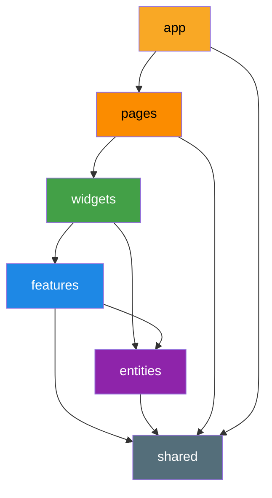
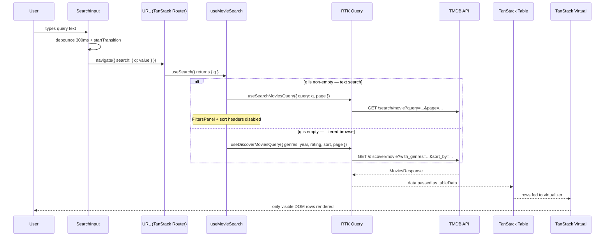

# Agent Prompt — Senior Frontend Challenge: TMDB Movie Explorer

## Project Overview

Build a production-grade **Talent Movie** single-page application using React, TypeScript, Redux Toolkit, Tailwind CSS, and the full TanStack suite. The architecture must follow **Feature-Sliced Design (FSD)**, be optimized for scalability in a mid-sized engineering organization (many features, many teams), and apply best practices for performance, security, and maintainability at every layer.

---

## Tech Stack (Mandatory)

| Concern           | Library                                           |
| ----------------- | ------------------------------------------------- |
| UI Framework      | React 18+ (with concurrent features)              |
| Language          | TypeScript 5+ (strict mode)                       |
| State Management  | Redux Toolkit (RTK) with RTK Query                |
| Routing           | TanStack Router v1                                |
| Data Table        | TanStack Table v8                                 |
| Virtualization    | TanStack Virtual v3                               |
| Styling           | Tailwind CSS v3                                   |
| Component Library | shadcn/ui (Radix UI primitives + Tailwind)        |
| Icons             | Lucide React                                      |
| Linting           | ESLint + eslint-plugin-react + @typescript-eslint |
| Formatting        | Prettier                                          |
| Unit Testing      | Vitest + React Testing Library                    |
| E2E Testing       | Playwright                                        |
| Build             | Vite                                              |
| Deployment        | Vercel                                            |

> **TanStack priority**: prefer TanStack solutions before any third-party alternative for routing, tables, querying, and virtualization.
> **shadcn/ui priority**: use shadcn/ui components for all UI primitives before writing custom ones. Never wrap a shadcn component in an unnecessary custom wrapper — extend via `className` and `variant` props instead.
> **Lucide React**: the sole icon library. No other icon set. Always import icons individually (`import { Star } from 'lucide-react'`) — never import the full bundle.

---

## Architecture: Feature-Sliced Design (FSD)

Strictly follow the [FSD specification](https://feature-sliced.design/). No cross-layer imports going upward (e.g., `shared` must never import from `features`).

```
src/
├── app/                        # App-level providers, global styles, router root
│   ├── providers/
│   │   ├── StoreProvider.tsx   # Redux store provider (RTK Query cache lives here — no separate QueryProvider needed)
│   │   └── RouterProvider.tsx  # TanStack Router provider
│   ├── router.ts               # Route tree (TanStack Router)
│   └── index.tsx
│
├── pages/                      # Route-level page components (thin, composing features)
│   ├── movies/
│   │   └── MoviesPage.tsx
│   ├── movie-detail/
│   │   └── MovieDetailPage.tsx
│   └── favorites/
│       └── FavoritesPage.tsx
│
├── widgets/                    # Composite UI blocks used across pages
│   ├── movie-table/
│   │   ├── ui/MovieTable.tsx   # Renders TanStack Table into shadcn Table primitives
│   │   │                       # Sort header buttons (SortHeader) live here — not in movie-sort feature
│   │   └── index.ts
│   ├── movie-detail-panel/
│   │   ├── ui/MovieDetailPanel.tsx
│   │   └── index.ts
│   └── favorites-list/
│       ├── ui/FavoritesList.tsx
│       └── index.ts
│
├── features/                   # User-facing interactions
│   ├── movie-search/
│   │   ├── model/useMovieSearch.ts  # ONLY place that imports both searchMovies + discoverMovies
│   │   │                            # from entities/movie — composes them based on q param
│   │   ├── ui/SearchInput.tsx
│   │   └── index.ts
│   ├── movie-filters/
│   │   ├── model/filtersSlice.ts
│   │   ├── ui/FiltersPanel.tsx
│   │   └── index.ts
│   ├── movie-sort/
│   │   ├── model/sortSlice.ts   # Sort state only — no UI here
│   │   └── index.ts             # Sort header UI is part of MovieTable widget, not this feature
│   ├── favorites/
│   │   ├── model/favoritesSlice.ts   # RTK slice + localStorage persistence
│   │   ├── ui/FavoriteToggle.tsx
│   │   └── index.ts
│   └── pagination/
│       ├── ui/Pagination.tsx    # Reads page from URL via useSearch(); writes via navigate()
│       └── index.ts             # No paginationSlice — page lives in the URL, not Redux
│
├── entities/                   # Business entities (data models + base UI)
│   └── movie/
│       ├── model/
│       │   ├── types.ts           # Movie, MovieDetail, MovieFilters TS types
│       │   └── movieApi.ts        # RTK Query createApi — exposes discoverMovies, searchMovies,
│       │                          # getMovieDetail, getGenres. No HTTP logic outside this file.
│       ├── ui/
│       │   └── MovieRow.tsx       # Base row rendering used by MovieTable widget
│       └── index.ts
│
└── shared/                     # Zero-dependency utilities and design system
    ├── api/
    │   └── constants.ts           # TMDB_BASE_URL, TMDB_IMAGE_BASE_URL — constants only, no HTTP client
    ├── config/
    │   └── env.ts                 # Typed env vars via import.meta.env
    ├── lib/
    │   ├── utils.ts               # shadcn's cn() helper (clsx + tailwind-merge)
    │   ├── sanitize.ts            # Input sanitization helpers
    │   └── storage.ts             # Type-safe localStorage wrapper
    ├── ui/                        # shadcn/ui installed components live here
    │   ├── button.tsx             # shadcn Button (installed via CLI)
    │   ├── badge.tsx              # shadcn Badge
    │   ├── skeleton.tsx           # shadcn Skeleton
    │   ├── input.tsx              # shadcn Input
    │   ├── select.tsx             # shadcn Select (Radix)
    │   ├── slider.tsx             # shadcn Slider (Radix)
    │   ├── dialog.tsx             # shadcn Dialog (Radix)
    │   ├── separator.tsx          # shadcn Separator
    │   ├── tooltip.tsx            # shadcn Tooltip (Radix)
    │   ├── popover.tsx            # shadcn Popover (Radix) — filter dropdowns
    │   ├── command.tsx            # shadcn Command — genre multi-select combobox
    │   ├── scroll-area.tsx        # shadcn ScrollArea — virtualized table container
    │   ├── table.tsx              # shadcn Table primitives (thead/tbody/tr/td wrappers)
    │   └── ErrorBoundary.tsx      # Custom (no shadcn equivalent)
    └── index.ts
```

Root-level files (outside `src/`):

```
e2e/                            # Playwright end-to-end tests
│   ├── fixtures/
│   │   └── index.ts            # Custom test fixtures (authenticated page, mock API)
│   ├── pages/                  # Page Object Models
│   │   ├── MoviesPage.ts
│   │   ├── MovieDetailPage.ts
│   │   └── FavoritesPage.ts
│   └── tests/
│       ├── movies-table.spec.ts
│       ├── movie-detail.spec.ts
│       └── favorites.spec.ts
│
vercel.json                     # Vercel routing + build config
.env.example                    # Committed env template
.env                            # Gitignored secrets
playwright.config.ts            # Playwright config
.github/
└── workflows/
    └── ci.yml                  # Lint + unit test + build + E2E pipeline
```

---

## Data Source

**API**: `https://api.themoviedb.org/3/discover/movie`
**Docs**: https://developer.themoviedb.org/reference/discover-movie

Store the TMDB Bearer token **exclusively** in `.env` as `VITE_TMDB_API_KEY`. Never commit this value. Access it only inside `entities/movie/model/movieApi.ts` via `prepareHeaders` in RTK Query's `fetchBaseQuery`. The key must be injected as an `Authorization: Bearer` header — never as a URL query parameter. There is no separate HTTP client (no Axios, no custom fetch wrapper) — all network calls go through RTK Query.

### Required Movie Table Columns (choose 5)

1. `title`
2. `release_date`
3. `vote_average`
4. `original_language`
5. `popularity`

---

## shadcn/ui Setup

Install shadcn/ui via its CLI — **never manually copy component files**. The CLI installs into `shared/ui/` and wires Tailwind automatically.

```bash
# Init (run once — select Vite, TypeScript, Tailwind, src/shared/ui as components path)
npx shadcn-ui@latest init

# Install all required components
npx shadcn-ui@latest add button badge skeleton input select slider \
  dialog separator tooltip popover command scroll-area table
```

**Configuration rules:**

- Set `components.json` → `aliases.components` to `@shared/ui` and `aliases.utils` to `@shared/lib/utils`. This ensures all shadcn internals resolve correctly under FSD paths.
- `shared/api/constants.ts` exports only two values — `TMDB_BASE_URL = 'https://api.themoviedb.org/3'` and `TMDB_IMAGE_BASE_URL = 'https://image.tmdb.org/t/p'`. No HTTP client logic lives in `shared/` — all HTTP is handled by `fetchBaseQuery` inside `entities/movie/model/movieApi.ts`.
- `shared/lib/utils.ts` must export the `cn` helper used by every shadcn component:
  ```typescript
  import { clsx, type ClassValue } from 'clsx';
  import { twMerge } from 'tailwind-merge';
  export function cn(...inputs: ClassValue[]) {
    return twMerge(clsx(inputs));
  }
  ```
- **Never edit installed shadcn component files directly** for one-off styling — extend using the `className` prop and `cn()`. Only edit the source file for global, intentional theme changes.
- **CSS variables**: shadcn uses CSS custom properties for theming (`--background`, `--foreground`, `--primary`, etc.). Define the design tokens in `app/globals.css` under `:root` and `.dark`. Do not hardcode color values in components — always reference the CSS variable layer via Tailwind's `bg-background`, `text-foreground`, etc.
- Implement a **dark mode toggle** using `next-themes` (or a simple class-based toggler on `<html>`), since shadcn ships dark variants for all components out of the box.

---

## Lucide React Usage

Lucide is the icon system for the entire app. Rules:

- Import individually: `import { Star, StarOff, ChevronUp, ChevronDown, SlidersHorizontal, Search, ArrowLeft, Film } from 'lucide-react'`
- Size via `size` prop (default `16`): `<Star size={18} />`. Never use CSS `width`/`height` overrides.
- Color via Tailwind `className`: `<Star className="text-yellow-400 fill-yellow-400" />`
- Pair with shadcn `Button` using the `size="icon"` variant for icon-only buttons: `<Button variant="ghost" size="icon"><Star /></Button>`
- Always add `aria-label` to icon-only buttons: `<Button variant="ghost" size="icon" aria-label="Add to favorites">`

### Icon Map

| Usage                | Icon                | State variant                                 |
| -------------------- | ------------------- | --------------------------------------------- |
| Favorites (inactive) | `Star`              | `className="text-muted-foreground"`           |
| Favorites (active)   | `Star`              | `className="text-yellow-400 fill-yellow-400"` |
| Sort ascending       | `ChevronUp`         |                                               |
| Sort descending      | `ChevronDown`       |                                               |
| Sort none            | `ChevronsUpDown`    | `className="text-muted-foreground"`           |
| Search input prefix  | `Search`            |                                               |
| Filters toggle       | `SlidersHorizontal` |                                               |
| Back navigation      | `ArrowLeft`         |                                               |
| Empty state          | `Film`              |                                               |
| Error state          | `CircleAlert`       | `className="text-destructive"`                |
| Loading (inline)     | `Loader2`           | `className="animate-spin"`                    |

---

## Feature Requirements

### 1. Movie Table (`widgets/movie-table`)

Build using **TanStack Table v8** headlessly, rendering into **shadcn `Table` primitives** (`<Table>`, `<TableHeader>`, `<TableBody>`, `<TableRow>`, `<TableHead>`, `<TableCell>`) for consistent styling.

- **Column definitions** typed with `ColumnDef<Movie>[]`.
- **Server-side pagination** via TMDB's `page` param — use TanStack Table's manual pagination mode. **Do not create a `paginationSlice`** — since the URL is the canonical source, read `page` directly from `useSearch()` and write it via `navigate({ search: (prev) => ({ ...prev, page: next }) })`. There is no Redux state to maintain. Render pagination controls using shadcn `Button` (prev/next) with `Lucide ChevronLeft` / `ChevronRight` icons; disable "prev" when `page === 1` and "next" when `page === data.total_pages`.
- **Server-side sorting** — map TanStack Table's `SortingState` to TMDB's `sort_by` query param. Column header sort buttons use shadcn `Button variant="ghost"` with `Lucide ChevronUp`, `ChevronDown`, or `ChevronsUpDown` based on sort state. Persist in `sortSlice`.
- **Debounced search** (300ms) — render as shadcn `Input` with a `Lucide Search` icon prefix. On each keystroke, update a local `inputValue` state immediately (so the input feels instant), then after the 300ms debounce fire `startTransition(() => navigate({ search: (prev) => ({ ...prev, q: debouncedValue, page: 1 }) }))`. Wrapping `navigate` in `startTransition` marks the resulting URL-driven re-render as non-urgent, keeping the input responsive during the table update. **Do not dispatch to `filtersSlice` from the search input** — the URL param `?q=` is the single source of truth; `useMovieSearch` reads it directly from `useSearch()`. Use `useDebounce` from `use-debounce` for the debounced value. While text search is active (`q` is non-empty), disable the `FiltersPanel` and sort headers and show a shadcn `Tooltip` on each explaining they are unavailable. The `?sort=` URL param is preserved silently during text search and auto-restored when the query is cleared.
- **Column filtering** — render in a collapsible `FiltersPanel` toggled by a shadcn `Button variant="outline"` with `Lucide SlidersHorizontal`. Implement exactly 3 filters:
  - `with_genres` — shadcn `Command` inside a `Popover` for multi-select combobox (checkboxes, OR logic, comma-separated IDs). Selected genres shown as shadcn `Badge` chips with `Lucide X` dismiss button.
  - `primary_release_year` — shadcn `Select` with a list of years.
  - `vote_average.gte` — shadcn `Slider` (0–10, step 0.5) with live numeric label.
  - Active filter count shown as a numeric `Badge` on the filters toggle button.
  - Multiple active filters combine with AND. Persist in `filtersSlice`.
- **Row click** — navigate to `/movies/:id` using TanStack Router `Link`.
- **Favorites toggle** — inline shadcn `Button variant="ghost" size="icon"` per row using `FavoriteToggle`, with `Lucide Star` filled/outlined via Tailwind class swap.
- **Row virtualization** — TanStack Virtual cannot absolutely position `<tr>` elements inside a `<tbody>` — native table layout prevents it. Use the **two-spacer padding technique** instead, which is valid HTML and matches TanStack Virtual's own table examples. Two `<tr>` spacers are required: one before the rendered rows (top padding) and one after (bottom padding). **Without the top spacer, all rows collapse to the top of the container on scroll** — this is the most common virtualization bug:

  ```tsx
  const virtualizer = useVirtualizer({
    count: rows.length,
    getScrollElement: () => tableContainerRef.current,
    estimateSize: () => 48,
    overscan: 5,
  });

  const virtualItems = virtualizer.getVirtualItems();
  const paddingTop = virtualItems[0]?.start ?? 0;
  const paddingBottom = virtualizer.getTotalSize() - (virtualItems.at(-1)?.end ?? 0);

  // Inside <TableBody>:
  {
    paddingTop > 0 && (
      <tr aria-hidden="true">
        <td style={{ height: paddingTop }} />
      </tr>
    );
  }
  {
    virtualItems.map((virtualRow) => {
      const row = rows[virtualRow.index];
      return (
        <TableRow key={row.id} aria-rowindex={virtualRow.index + 2} data-testid="movie-row">
          ...
        </TableRow>
      );
    });
  }
  {
    paddingBottom > 0 && (
      <tr aria-hidden="true">
        <td style={{ height: paddingBottom }} />
      </tr>
    );
  }
  ```

  Wrap the entire `<Table>` in a plain `<div ref={tableContainerRef} style={{ overflowY: 'auto', height: '600px' }}>` scroll container — **not** a shadcn `ScrollArea` (which intercepts scroll events and breaks the virtualizer's scroll listener). Add `role="grid"` and `aria-rowcount={data?.total_results ?? -1}` to this outer `<div>`.

- **Loading state** — replace data rows with N shadcn `Skeleton` rows (matching column widths) while `isFetching`.
- **Empty state** — when query returns 0 results, show a centered `Lucide Film` icon with a muted message.
- **Error state** — inline `ErrorBoundary` fallback with `Lucide CircleAlert` and a shadcn `Button` retry action.

### 2. Movie Detail Page (`pages/movie-detail`)

- Route: `/movies/:movieId` (typed param via TanStack Router).
- Fetch `/movie/:id` via a separate RTK Query endpoint.
- Layout: two-column (poster left, metadata right) on `md+`, stacked on mobile.
- **Poster**: `` with `loading="lazy"`, `alt` text, and a shadcn `Skeleton` placeholder until loaded.
- **Metadata**: title as `h1`, overview as body text, genres as shadcn `Badge variant="secondary"` chips, `vote_average` with a `Lucide Star` inline icon, release date, runtime, and original language.
- shadcn `Separator` between metadata sections.
- `FavoriteToggle` rendered as a full shadcn `Button variant="outline"` with label "Add to Favorites" / "Remove from Favorites" and a `Lucide Star` icon.
- Back navigation: shadcn `Button variant="ghost"` with `Lucide ArrowLeft`, using TanStack Router `useNavigate`.
- **Loading**: full-page `Skeleton` mirroring the two-column layout.
- **Error**: shadcn `Alert variant="destructive"` with `Lucide CircleAlert` and retry.

### 3. Favorites (`features/favorites`)

- **RTK slice** (`favoritesSlice`) storing `Record<number, Movie>`.
- **Persistence** — Redux middleware syncing `favorites` to `localStorage` on every change. Hydrate via `preloadedState` on init.
- **Favorites route**: `/favorites` — renders `FavoritesList` widget using a client-side TanStack Table instance (no API call). Same shadcn `Table` primitives as the main table.
- **Empty state**: centered `Lucide Heart` icon with a shadcn `Button` linking back to `/movies`.
- **FavoriteToggle** component: `Lucide Star` inside shadcn `Button variant="ghost" size="icon"`. Filled yellow (`fill-yellow-400 text-yellow-400`) when active, muted when inactive. Accessible `aria-label` and full keyboard support.

---

## State Management Rules

**URL sync — URL is the canonical source of truth for all table state.** TanStack Router owns `query`, `filters`, `sort`, and `page` as typed search params validated with Zod. Redux slices are the in-memory projection of those params. The correct flow is:

1. On mount, read URL search params via `useSearch()` and dispatch the corresponding Redux actions to hydrate each slice.
2. On every user interaction (typing, filter change, sort click, page change), call `navigate({ search: (prev) => ({ ...prev, ...newParam }) })` to update the URL first.
3. A `useEffect` watching the URL search params then dispatches to Redux, keeping both in sync without a manual write-back loop.

> **Never** treat Redux as the canonical source and sync it back to the URL. That pattern produces bidirectional `useEffect` chains that cause infinite re-render loops and stale state on direct URL navigation or browser back/forward.

| State                             | Canonical location                         | Redux role                                                          |
| --------------------------------- | ------------------------------------------ | ------------------------------------------------------------------- |
| Server data (movies, detail)      | RTK Query cache                            | Cache owner                                                         |
| Search query                      | URL search param `?q=`                     | Not in Redux — read directly from `useSearch()` in `useMovieSearch` |
| Active filters                    | URL search params `?genres=&year=&rating=` | Hydrated from URL on change via `filtersSlice`                      |
| Sort state                        | URL search param `?sort=popularity.desc`   | Hydrated from URL on change via `sortSlice`                         |
| Pagination                        | URL search param `?page=1`                 | Not in Redux — read directly from `useSearch()`                     |
| Favorites                         | `favoritesSlice` (Redux) + localStorage    | Persisted client state — no URL sync needed                         |
| UI-only state (open/close, hover) | Local `useState`                           | Not in Redux                                                        |

---

## API Integration (`entities/movie/model/movieApi.ts`)

### Dual-endpoint search strategy

The TMDB `/discover/movie` endpoint does **not** support free-text search — it only accepts structured filter params. To support both text search and filtered browsing in the same table, expose two endpoints and compose them in `useMovieSearch`:

- **Text search active** (`query` is non-empty): route to `GET /search/movie?query=<value>&page=<n>`. Sort and filter params are not supported by this endpoint and must be disabled in the UI while a text query is active.
- **Text search empty**: route to `GET /discover/movie` with `with_genres`, `primary_release_year`, `vote_average.gte`, `sort_by`, and `page` params.

Implement this inside `features/movie-search/model/useMovieSearch.ts` using RTK Query's `skip` option — **never conditionally call hooks**. Both hooks are called unconditionally on every render; `skip` controls which one actually fires a request:

```typescript
// features/movie-search/model/useMovieSearch.ts
export function useMovieSearch() {
  const { q, genres, year, rating, sort, page } = useSearch({ strict: false });
  const isTextSearch = (q ?? '').trim().length > 0;

  // Both hooks called unconditionally — Rules of Hooks compliant
  const searchResult = useSearchMoviesQuery(
    { query: q ?? '', page: page ?? 1 },
    { skip: !isTextSearch },
  );
  const discoverResult = useDiscoverMoviesQuery(
    { genres, year, rating, sort, page: page ?? 1 },
    { skip: isTextSearch },
  );

  // Return the active result; the skipped query will have { data: undefined, isFetching: false }
  return {
    ...(isTextSearch ? searchResult : discoverResult),
    isTextSearch,
  };
}
```

When `isTextSearch` is true: disable the FiltersPanel and sort headers in the UI (show a `Tooltip` explaining they are unavailable during text search). **Preserve the `?sort=` URL param silently** — do not clear it when a query is typed. When the text query is cleared, the discover endpoint resumes and the preserved sort param is automatically re-applied with no extra logic needed.

### `getGenres` — consumption and usage

`getGenres` is called **once on app mount** via `useGetGenresQuery()` inside `features/movie-filters/ui/FiltersPanel.tsx`. It does not need to be pre-fetched in a route loader — genre lists are static (TMDB updates them infrequently) and the `keepUnusedDataFor: 600` cache means subsequent mounts never re-fetch.

```typescript
// features/movie-filters/ui/FiltersPanel.tsx
const { data: genresData, isLoading: genresLoading } = useGetGenresQuery();
const genres = genresData?.genres ?? []; // Genre[]  → { id: number, name: string }[]
```

- Populate the `Command` combobox with `genres.map(g => ({ value: String(g.id), label: g.name }))`.
- When a genre is selected, store its **numeric ID** in the URL as `?genres=28,12` (comma-separated). The `with_genres` TMDB param expects IDs, not names.
- Render selected genre **names** in the `Badge` dismiss chips by looking up `genres.find(g => g.id === id)?.name` — never store the name in the URL.
- While `genresLoading` is true, show a shadcn `Skeleton` inside the `Popover` instead of the `Command` list.
- `useGetGenresQuery` follows the same FSD boundary rule as the movie endpoints — only `FiltersPanel` may import it directly, since it is the sole consumer.

`useMovieSearch` is the **only** file in the codebase permitted to import both `useSearchMoviesQuery` and `useDiscoverMoviesQuery` from `@entities/movie`. This is an allowed `features → entities` import under FSD. No other layer — widgets, pages, or other features — may import these RTK Query hooks directly. All table consumers of movie data must go through `useMovieSearch`.

```
✅  features/movie-search/model/useMovieSearch.ts  →  entities/movie/model/movieApi.ts
❌  widgets/movie-table/ui/MovieTable.tsx           →  entities/movie/model/movieApi.ts
❌  pages/movies/MoviesPage.tsx                     →  entities/movie/model/movieApi.ts
```

This boundary keeps the dual-endpoint composition logic in a single, testable location and prevents API coupling from leaking into the render layer.

### RTK Query `createApi` definition

```typescript
// entities/movie/model/movieApi.ts
import { createApi, fetchBaseQuery } from '@reduxjs/toolkit/query/react'

export const movieApi = createApi({
  reducerPath: 'movieApi',
  baseQuery: fetchBaseQuery({
    baseUrl: 'https://api.themoviedb.org/3',
    prepareHeaders: (headers) => {
      headers.set('Authorization', `Bearer ${import.meta.env.VITE_TMDB_API_KEY}`)
      headers.set('Content-Type', 'application/json')
      return headers
    },
  }),
  tagTypes: ['Movies', 'SearchResults', 'MovieDetail', 'Genres'],
  endpoints: (builder) => ({
    discoverMovies: builder.query<MoviesResponse, DiscoverMoviesParams>({ ... }),
    searchMovies:   builder.query<MoviesResponse, SearchMoviesParams>({ ... }),
    getMovieDetail: builder.query<MovieDetail, number>({ ... }),
    getGenres:      builder.query<GenresResponse, void>({ ... }),
  }),
})
```

- All query params sanitized before appending — strip `<`, `>`, `"`, `'`, `&` from text inputs.
- Apply `providesTags` on all read endpoints for cache invalidation.
- Use `keepUnusedDataFor: 300` (5 min) for movie lists and search results; `keepUnusedDataFor: 600` for detail pages.
- Use `refetchOnMountOrArgChange: 60` — refetch only if cached data is older than 60 seconds. This avoids redundant in-flight requests on rapid remounts while still surfacing reasonably fresh data, unlike `false` which can silently show stale content to returning users.

---

## Routing (`app/router.ts`)

Use **TanStack Router v1** with file-based or code-based route tree:

```
/                        → redirect to /movies
/movies                  → MoviesPage (table + filters)
/movies/:movieId         → MovieDetailPage
/favorites               → FavoritesPage
```

- All routes use **typed params and search params** via TanStack Router's `Route` generics.
- Implement **lazy loading** for each page component using `React.lazy` + `Suspense`, or TanStack Router's built-in `loader` + code splitting.
- Add a `notFoundComponent` for unmatched routes.
- Wrap the router in an `ErrorBoundary` at the `app` level.

---

## TypeScript Requirements

- Enable `strict: true` in `tsconfig.json`.
- No `any` — use `unknown` and narrow explicitly where needed.
- All API response shapes typed (derive from TMDB OpenAPI spec or define manually).
- All Redux state slices typed using `RootState` and `AppDispatch` exports.
- TanStack Table column defs typed: `ColumnDef<Movie, unknown>[]`.
- TanStack Router routes fully typed with search params schemas (use Zod for validation).
- Use `satisfies` operator where appropriate.
- All environment variables accessed through `shared/config/env.ts` with typed interface.

---

## Performance Best Practices

- **Code splitting**: every page-level component lazy-loaded.
- **Memoization**: `React.memo` on `MovieRow`, `useMemo` for column defs and derived filter selectors, `useCallback` for handlers passed to child components.
- **Virtualization**: TanStack Virtual on table rows to keep DOM nodes bounded.
- **Image optimization**: lazy-load all poster images (`loading="lazy"`); render a shadcn `Skeleton` component sized to the image dimensions while the image is loading. Track load state with a local `useState(false)` + `onLoad` handler — hide the `Skeleton` and reveal the `` once loaded (use `className={isLoaded ? 'block' : 'hidden'}` on the image and `className={isLoaded ? 'hidden' : 'block'}` on the `Skeleton`).
- **Concurrent features**: wrap the `navigate()` call inside `startTransition` on search input and filter changes — this marks the URL-driven table re-render as non-urgent, so the input and filter UI remain responsive while the new rows render. `startTransition` must wrap the `navigate()` call itself, not a Redux dispatch (navigation is a state transition; dispatching to a Redux slice that mirrors URL state is redundant and should be avoided). Enable `React.StrictMode` in development (`app/index.tsx`) to surface double-invocation bugs early.
- **Stable references**: define column defs and selector functions outside render or with `useMemo`.
- **RTK Query deduplication**: concurrent components requesting the same query share one in-flight request.
- **Avoid over-rendering**: use `shallowEqual` from `react-redux` in `useSelector` for object selectors.
- **Bundle**: configure Vite to split vendor chunks for react, tanstack, and redux separately.

---

## Accessibility

A virtualised table has unique accessibility requirements because the DOM only contains the visible row subset. Screen readers will misreport row counts and positions without explicit ARIA attributes.

**Required ARIA on the virtualised table:**

```tsx
<div
  ref={tableContainerRef}
  role="grid"
  aria-label="Movies"
  aria-rowcount={data?.total_results ?? -1} // total from API, not DOM rows
  style={{ overflowY: 'auto', height: '600px' }}
>
  <Table>
    <TableHeader>
      <TableRow role="row">
        {headers.map((header) => (
          <TableHead
            key={header.id}
            role="columnheader"
            aria-sort={
              header.column.getIsSorted() === 'asc'
                ? 'ascending'
                : header.column.getIsSorted() === 'desc'
                  ? 'descending'
                  : 'none'
            }
          />
        ))}
      </TableRow>
    </TableHeader>
    <TableBody>
      {virtualizer.getVirtualItems().map((virtualRow) => {
        const row = rows[virtualRow.index];
        return (
          <TableRow
            key={row.id}
            role="row"
            aria-rowindex={virtualRow.index + 2} // +2: 1-based index, +1 for header row
            data-testid="movie-row"
          />
        );
      })}
      {/* padding spacer */}
    </TableBody>
  </Table>
</div>
```

**Additional requirements:**

- All `<TableHead>` sort buttons must have `aria-label="Sort by {column name}"`.
- The `FavoriteToggle` button must have `aria-label="Add {title} to favorites"` / `aria-pressed={isFavorite}` so screen readers announce both the action and current state.
- Filter `Popover` triggers must have `aria-expanded` and `aria-haspopup="listbox"` — Radix UI's `PopoverTrigger` handles this automatically; do not override it.
- The `SearchInput` must have `aria-label="Search movies"` and `aria-controls` pointing to the table container `id`.
- Skeleton rows must have `role="status"` and `aria-label="Loading"` on their container so loading state is announced.

---

## Security Best Practices

- API key **only** in `.env`, accessed only via `prepareHeaders` in `entities/movie/model/movieApi.ts`. Add `.env` to `.gitignore`.
- Sanitize all user text inputs (search, any free-text field) before including in query strings — strip or encode `<`, `>`, `"`, `'`, and `&`.
- All external URLs (movie links, image paths) validated against a whitelist of known TMDB domains before rendering.
- No use of `dangerouslySetInnerHTML` anywhere. If needed, use `DOMPurify`.
- CSP-friendly: no inline styles injected via JavaScript.
- `localStorage` values deserialized defensively with try/catch and a schema check (e.g., Zod) to guard against tampered storage.

---

## Scalability & Code Quality

- **Barrel exports** (`index.ts`) at each FSD layer boundary — external slices only import from the public API of a segment, never deep-import.
- **Co-located tests**: `__tests__/` directory inside each feature/entity segment.
- **ESLint rules**: enforce FSD import rules using `eslint-plugin-boundaries` or similar; disallow cross-layer violations.
- **Prettier**: configure with `singleQuote: true`, `trailingComma: 'all'`, `printWidth: 100`.
- **Husky + lint-staged**: pre-commit hooks running ESLint and Prettier on staged files.
- **Absolute imports**: configure `paths` in `tsconfig.json` mapping `@app`, `@pages`, `@widgets`, `@features`, `@entities`, `@shared` to their respective directories.

---

## Error Management

- **Global ErrorBoundary** at app root — renders a full-page shadcn `Alert variant="destructive"` with `Lucide CircleAlert` and a "Reload page" `Button`.
- **Per-feature ErrorBoundary** around the table widget and the detail panel — renders an inline shadcn `Alert` with a retry `Button`.
- RTK Query `error` state handled in every query consumer: show shadcn `Alert variant="destructive"` with `Lucide CircleAlert` + retry `Button`.
- Unhandled promise rejections caught globally via `window.addEventListener('unhandledrejection', ...)` in `app/index.tsx`.
- All `localStorage` operations in a try/catch.
- HTTP errors classified and mapped to shadcn `Alert` messages: 401 → "Invalid API key"; 404 → "Not found"; 429 → "Rate limited, retry in Xs" (parse `Retry-After` header); 5xx → "Something went wrong" with retry.

---

## Loading States

- **Table**: replace data rows with N shadcn `Skeleton` components (matching column widths, animated pulse) while `isFetching`. Use `Array.from({ length: 10 })` to render placeholder rows.
- **Movie detail**: full-page shadcn `Skeleton` layout matching the two-column structure — poster block left, text lines right.
- **Initial app load**: centered `Lucide Loader2` icon with `animate-spin` wrapped in a full-screen div until router resolves and first query settles.
- **Pagination**: overlay the table with a semi-transparent div + `Lucide Loader2` spinner (not full-screen) during page transitions — do not replace the existing rows.
- **Inline async** (filter fetch, genres fetch): `Lucide Loader2` inside the triggering `Button` replacing the icon, with `disabled` state.
- Use `React.Suspense` fallback with a centered `Lucide Loader2` for lazy-loaded routes.

---

## Unit Tests

### Test Infrastructure (required before writing any test)

Generate `vitest.config.ts` at the project root:

```typescript
import { defineConfig } from 'vitest/config';
import react from '@vitejs/plugin-react';
import { resolve } from 'path';

export default defineConfig({
  plugins: [react()],
  test: {
    environment: 'jsdom',
    globals: true,
    setupFiles: ['./vitest.setup.ts'],
  },
  resolve: {
    alias: {
      '@app': resolve(__dirname, 'src/app'),
      '@pages': resolve(__dirname, 'src/pages'),
      '@widgets': resolve(__dirname, 'src/widgets'),
      '@features': resolve(__dirname, 'src/features'),
      '@entities': resolve(__dirname, 'src/entities'),
      '@shared': resolve(__dirname, 'src/shared'),
    },
  },
});
```

Generate `vitest.setup.ts` at the project root:

```typescript
import '@testing-library/jest-dom';
```

This file is mandatory — without it, all `expect(element).toBeInTheDocument()` and related RTL matchers throw `TypeError` at runtime.

Generate `src/shared/lib/test-utils.tsx` with a `renderWithProviders` helper:

```typescript
import { type PropsWithChildren } from 'react'
import { render, type RenderOptions } from '@testing-library/react'
import { Provider } from 'react-redux'
import { createMemoryHistory, createRouter, RouterProvider } from '@tanstack/react-router'
import { setupStore, type AppStore, type RootState } from '@app/store'
import { routeTree } from '@app/router'

interface ExtendedRenderOptions extends Omit<RenderOptions, 'queries'> {
  preloadedState?: Partial<RootState>
  store?: AppStore
  initialPath?: string
}

export function renderWithProviders(
  ui: React.ReactElement,
  {
    preloadedState = {},
    store = setupStore(preloadedState),
    initialPath = '/movies',
    ...renderOptions
  }: ExtendedRenderOptions = {},
) {
  const router = createRouter({
    routeTree,
    history: createMemoryHistory({ initialEntries: [initialPath] }),
  })

  function Wrapper({ children }: PropsWithChildren) {
    return (
      <Provider store={store}>
        <RouterProvider router={router} />
        {children}
      </Provider>
    )
  }
  return { store, router, ...render(ui, { wrapper: Wrapper, ...renderOptions }) }
}
```

> **Why the router wrapper is mandatory**: every component that calls `useSearch()`, `useNavigate()`, or `useParams()` — including `SearchInput`, `MovieTable`, `Pagination`, `MovieDetailPanel`, and `FavoriteToggle` — throws `"No router context found"` if mounted without a router. `createMemoryHistory` avoids the need for a real browser URL during tests, and `initialPath` lets individual tests start at a specific URL (e.g., `'/movies/:id'`) to test route-param-dependent components.

### Test Cases

Write unit tests for **`MovieTable`** (inside `widgets/movie-table/__tests__/MovieTable.test.tsx`):

1. Renders skeleton rows when `isLoading` is true.
2. Renders correct number of movie rows when data is loaded.
3. Clicking a row navigates to the correct detail route.
4. Sorting a column updates the `sortSlice` state.
5. The search debounce fires the query only after 300ms.
6. Toggling a favorite dispatches the correct Redux action.
7. Displays error state with retry button when query fails.

Use `vi.mock` for RTK Query hooks and TanStack Router. Wrap each test in `renderWithProviders`.

---

## End-to-End Tests (Playwright)

### Setup

```bash
npm install --save-dev @playwright/test
npx playwright install --with-deps chromium
```

Configure `playwright.config.ts` at the project root:

```typescript
import { defineConfig, devices } from '@playwright/test';

export default defineConfig({
  testDir: './e2e/tests',
  fullyParallel: true,
  forbidOnly: !!process.env.CI,
  retries: process.env.CI ? 2 : 0,
  workers: process.env.CI ? 1 : undefined,
  reporter: [['html', { outputFolder: 'playwright-report' }], ['list']],
  use: {
    baseURL: process.env.PLAYWRIGHT_BASE_URL ?? 'http://localhost:5173',
    trace: 'on-first-retry',
    screenshot: 'only-on-failure',
  },
  projects: [{ name: 'chromium', use: { ...devices['Desktop Chrome'] } }],
  webServer: {
    command: 'npm run dev',
    url: 'http://localhost:5173',
    reuseExistingServer: !process.env.CI,
  },
});
```

### Page Object Models (`e2e/pages/`)

Each page has a typed POM class encapsulating selectors and actions. Use `data-testid` attributes for all Playwright selectors — never couple tests to CSS classes or text content.

```typescript
// e2e/pages/MoviesPage.ts
import { type Page, type Locator } from '@playwright/test';

export class MoviesPage {
  readonly searchInput: Locator;
  readonly filtersToggle: Locator;
  readonly tableRows: Locator;
  readonly skeletonRows: Locator;
  readonly paginationNext: Locator;

  constructor(private page: Page) {
    this.searchInput = page.getByTestId('search-input');
    this.filtersToggle = page.getByTestId('filters-toggle');
    this.tableRows = page.getByTestId('movie-row');
    this.skeletonRows = page.getByTestId('skeleton-row');
    this.paginationNext = page.getByTestId('pagination-next');
  }

  async goto() {
    await this.page.goto('/movies');
  }
  async search(query: string) {
    await this.searchInput.fill(query);
    await this.page.waitForTimeout(350); // wait for debounce
  }
  async clickRow(index: number) {
    await this.tableRows.nth(index).click();
  }
}
```

Define equivalent POMs for `MovieDetailPage` and `FavoritesPage`.

### Required Test Specs

**`e2e/tests/movies-table.spec.ts`**

1. Table loads and renders at least 1 row after skeleton disappears.
2. Searching "Inception" filters rows to relevant titles (assert row count changes).
3. Clicking the genre filter opens the popover and selecting a genre updates the active badge count.
4. Clicking a column sort header changes the sort icon (assert `aria-sort` attribute).
5. Clicking "Next page" increments the page number in the URL search params.
6. Clicking a row navigates to `/movies/:id`.

**`e2e/tests/movie-detail.spec.ts`**

1. Movie detail page renders title, poster image (not broken), and genre badges.
2. The poster `Skeleton` is replaced by the actual image once loaded.
3. Clicking "Add to Favorites" changes the button label and persists on reload.
4. Back navigation returns to `/movies` with table state (URL params) preserved.

**`e2e/tests/favorites.spec.ts`**

1. Navigating to `/favorites` when empty shows the empty state with a link to `/movies`.
2. Adding a movie from the table and visiting `/favorites` shows that movie.
3. Removing a favorite from the favorites table removes the row.
4. Favorites persist across a full page reload (localStorage hydration).

### `data-testid` Convention

Add `data-testid` attributes to the following elements (the agent must apply these in the component code):

| Element                | `data-testid`               |
| ---------------------- | --------------------------- |
| Search input           | `search-input`              |
| Filters toggle button  | `filters-toggle`            |
| Active filter badge    | `filter-badge-count`        |
| Table row              | `movie-row`                 |
| Skeleton row           | `skeleton-row`              |
| Sort header button     | `sort-header-{columnId}`    |
| Pagination next        | `pagination-next`           |
| Pagination prev        | `pagination-prev`           |
| Favorite toggle button | `favorite-toggle-{movieId}` |
| Movie detail poster    | `movie-poster`              |
| Movie detail title     | `movie-title`               |
| Back button            | `back-button`               |
| Favorites empty state  | `favorites-empty`           |

### CI Pipeline (`.github/workflows/ci.yml`)

Generate this full workflow file at `.github/workflows/ci.yml`:

```yaml
name: CI

on:
  push:
    branches: [main, develop]
  pull_request:
    branches: [main, develop]

jobs:
  quality:
    name: Lint, Type-check & Unit Tests
    runs-on: ubuntu-latest
    steps:
      - uses: actions/checkout@v4

      - uses: actions/setup-node@v4
        with:
          node-version: 20
          cache: npm

      - name: Install dependencies
        run: npm ci

      - name: Lint (zero warnings)
        run: npm run lint

      - name: Type-check
        run: npx tsc --noEmit

      - name: Unit tests
        run: npm run test

  build:
    name: Production Build
    runs-on: ubuntu-latest
    needs: quality
    steps:
      - uses: actions/checkout@v4

      - uses: actions/setup-node@v4
        with:
          node-version: 20
          cache: npm

      - name: Install dependencies
        run: npm ci

      - name: Build
        run: npm run build
        env:
          VITE_TMDB_API_KEY: ${{ secrets.VITE_TMDB_API_KEY }}

      - name: Upload build artifact
        uses: actions/upload-artifact@v4
        with:
          name: dist
          path: dist/

  e2e:
    name: Playwright E2E Tests
    runs-on: ubuntu-latest
    needs: build
    steps:
      - uses: actions/checkout@v4

      - uses: actions/setup-node@v4
        with:
          node-version: 20
          cache: npm

      - name: Install dependencies
        run: npm ci

      - name: Install Playwright browsers
        run: npx playwright install --with-deps chromium

      - name: Run E2E tests
        run: npm run test:e2e
        env:
          PLAYWRIGHT_BASE_URL: ${{ secrets.VERCEL_PREVIEW_URL }}
          VITE_TMDB_API_KEY: ${{ secrets.VITE_TMDB_API_KEY }}

      - name: Upload Playwright report
        uses: actions/upload-artifact@v4
        if: always()
        with:
          name: playwright-report
          path: playwright-report/
          retention-days: 14
```

Required GitHub repository secrets: `VITE_TMDB_API_KEY`, `VERCEL_PREVIEW_URL` (auto-populated by Vercel's GitHub integration for PR preview URLs).

---

## Vercel Deployment

### `vercel.json`

Place at the project root. This configures SPA fallback routing (critical for TanStack Router client-side navigation), security headers, and cache policies for static assets:

```json
{
  "buildCommand": "npm run build",
  "outputDirectory": "dist",
  "framework": "vite",
  "rewrites": [{ "source": "/(.*)", "destination": "/index.html" }],
  "headers": [
    {
      "source": "/assets/(.*)",
      "headers": [{ "key": "Cache-Control", "value": "public, max-age=31536000, immutable" }]
    },
    {
      "source": "/(.*)",
      "headers": [
        { "key": "X-Content-Type-Options", "value": "nosniff" },
        { "key": "X-Frame-Options", "value": "DENY" },
        { "key": "X-XSS-Protection", "value": "1; mode=block" },
        { "key": "Referrer-Policy", "value": "strict-origin-when-cross-origin" },
        { "key": "Permissions-Policy", "value": "camera=(), microphone=(), geolocation=()" }
      ]
    }
  ]
}
```

### Environment Variables on Vercel

- In the Vercel dashboard → Project Settings → Environment Variables, add `VITE_TMDB_API_KEY` for **Production**, **Preview**, and **Development** environments.
- Never use Vercel's "Expose to browser" toggle for secrets — for Vite, any `VITE_` prefixed variable is already bundled into the client. This is acceptable here because the TMDB Bearer token is a read-only public API key. Document this clearly in the README.
- For any future server-side secrets (e.g., a private API key), use a Vercel Edge Function or serverless function as a proxy instead of exposing via `VITE_`.

### `vite.config.ts` — Production Build

```typescript
import { defineConfig } from 'vite';
import react from '@vitejs/plugin-react';
import { resolve } from 'path';

export default defineConfig({
  plugins: [react()],
  resolve: {
    alias: {
      '@app': resolve(__dirname, 'src/app'),
      '@pages': resolve(__dirname, 'src/pages'),
      '@widgets': resolve(__dirname, 'src/widgets'),
      '@features': resolve(__dirname, 'src/features'),
      '@entities': resolve(__dirname, 'src/entities'),
      '@shared': resolve(__dirname, 'src/shared'),
    },
  },
  build: {
    target: 'es2020',
    sourcemap: false, // disable in production; enable for staging
    rollupOptions: {
      output: {
        manualChunks: {
          'vendor-react': ['react', 'react-dom'],
          'vendor-tanstack': [
            '@tanstack/react-table',
            '@tanstack/react-router',
            '@tanstack/react-query',
            '@tanstack/react-virtual',
          ],
          'vendor-redux': ['@reduxjs/toolkit', 'react-redux'],
          'vendor-ui': [
            '@radix-ui/react-dialog',
            '@radix-ui/react-popover',
            '@radix-ui/react-select',
            '@radix-ui/react-slider',
          ],
        },
      },
    },
  },
});
```

### `package.json` Scripts

Ensure the following scripts are present so Vercel's build pipeline and CI both work without extra configuration:

```json
{
  "scripts": {
    "dev": "vite",
    "build": "tsc --noEmit && vite build",
    "preview": "vite preview",
    "lint": "eslint src --ext .ts,.tsx --max-warnings 0",
    "format": "prettier --write src",
    "test": "vitest run",
    "test:watch": "vitest",
    "test:e2e": "playwright test",
    "test:e2e:ui": "playwright test --ui"
  }
}
```

> The `build` script runs `tsc --noEmit` before `vite build` — this makes Vercel deployments fail fast on TypeScript errors rather than silently shipping broken types.

---

## README

The README must be the single source of truth for onboarding a new engineer. Generate `README.md` at the project root with the following sections:

### 1. Overview

Brief description of the app, its purpose, and the key technologies used.

### 2. Architecture Diagram (MermaidJS)

Include two diagrams:

**FSD layer dependency graph** — shows the allowed import direction between FSD layers:

````markdown

````

**Data flow diagram** — shows how user input routes to the correct TMDB endpoint and reaches the rendered table:

````markdown

````

### 3. Getting Started

```bash
git clone <repo>
cd tmdb-movie-explorer
npm install
cp .env.example .env        # fill in VITE_TMDB_API_KEY
npm run dev
```

### 4. Environment Variables

| Variable            | Description                   | Required |
| ------------------- | ----------------------------- | -------- |
| `VITE_TMDB_API_KEY` | TMDB Bearer token (read-only) | Yes      |

> **Note**: `VITE_` prefixed variables are bundled into the client build by Vite and are visible in the browser. The TMDB API key is a read-only public API credential — this is an acceptable exposure. Do not add write-access or admin credentials here.

### 5. Available Scripts

| Script                | Description                      |
| --------------------- | -------------------------------- |
| `npm run dev`         | Start Vite dev server            |
| `npm run build`       | Type-check + production build    |
| `npm run preview`     | Preview production build locally |
| `npm run lint`        | ESLint (zero warnings policy)    |
| `npm run format`      | Prettier format                  |
| `npm run test`        | Vitest unit tests (single run)   |
| `npm run test:watch`  | Vitest in watch mode             |
| `npm run test:e2e`    | Playwright E2E tests             |
| `npm run test:e2e:ui` | Playwright with interactive UI   |

### 6. Architecture Decisions & Tradeoffs

Include this table verbatim — it documents the key design choices and their rationale:

| Decision          | Choice                                              | Alternative Considered                      | Tradeoff                                                                                                                                                                                                                                                                                                                                                                       |
| ----------------- | --------------------------------------------------- | ------------------------------------------- | ------------------------------------------------------------------------------------------------------------------------------------------------------------------------------------------------------------------------------------------------------------------------------------------------------------------------------------------------------------------------------ |
| Architecture      | Feature-Sliced Design                               | Colocation by type (components/, hooks/)    | FSD adds upfront overhead but enforces boundaries that prevent spaghetti imports as the codebase grows                                                                                                                                                                                                                                                                         |
| Routing           | TanStack Router v1                                  | React Router v6 (**required by challenge**) | TanStack Router provides full end-to-end type-safety on params and search params with zero manual typing; React Router v6 requires `as` casts for typed params. **This is a deliberate deviation from the challenge spec** — justify it explicitly in the PR description and README. Acknowledge the grading risk: the evaluator may penalise unfamiliarity with React Router. |
| Server state      | RTK Query (inside Redux)                            | TanStack Query standalone                   | RTK Query keeps everything in Redux DevTools; TanStack Query has a richer API (optimistic updates, infinite scroll). Chosen for Redux cohesion                                                                                                                                                                                                                                 |
| Table             | TanStack Table (headless) + shadcn Table primitives | AG Grid, React Table v7                     | Full control over markup and styling; no licensing cost; headless requires more wiring than opinionated grids                                                                                                                                                                                                                                                                  |
| Virtualization    | TanStack Virtual                                    | react-window, react-virtuoso                | Shares the TanStack ecosystem; lower bundle weight vs react-virtuoso; requires manual wiring vs higher-level abstractions                                                                                                                                                                                                                                                      |
| Component library | shadcn/ui                                           | MUI, Ant Design                             | shadcn components are owned code (not a dependency); fully Tailwind-native; no version-lock risk. Tradeoff: more initial setup, fewer out-of-the-box components than MUI                                                                                                                                                                                                       |
| State persistence | Redux middleware → localStorage                     | Redux Persist                               | Explicit middleware gives full control; Redux Persist is simpler but adds a dependency and can cause subtle hydration issues                                                                                                                                                                                                                                                   |
| Icons             | Lucide React                                        | Heroicons, Phosphor                         | Lucide has the widest icon set in the React ecosystem with consistent design; tree-shakeable; Heroicons is more limited                                                                                                                                                                                                                                                        |
| Deployment        | Vercel                                              | Netlify, AWS Amplify                        | Vercel has first-class Vite support, preview deployments per PR, and zero-config SPA routing via `vercel.json` rewrites                                                                                                                                                                                                                                                        |

### 7. Theming (Dark Mode)

shadcn/ui uses CSS custom properties. To change the theme, edit the `:root` and `.dark` blocks in `app/globals.css`. Refer to the [shadcn theming docs](https://ui.shadcn.com/docs/theming) for available variables.

### 8. Deployment

The app is deployed to Vercel. Each push to `main` triggers a production deployment. Each PR gets an isolated preview URL, which is used as the `PLAYWRIGHT_BASE_URL` for E2E tests in CI.

```bash
# Manual deploy (requires Vercel CLI)
npm i -g vercel
vercel --prod
```

Follow this branching model:

- `main` — production-ready, protected
- `develop` — integration branch
- `feature/<ticket>-<short-description>` — one branch per feature
- `fix/<ticket>-<description>` — hotfixes
- Commit messages follow **Conventional Commits**: `feat:`, `fix:`, `refactor:`, `test:`, `chore:`, `docs:`
- PRs require passing lint + test CI before merge

Suggested commit sequence:

1. `chore: init vite project with typescript, tailwind and strict mode`
2. `chore: setup fsd directory structure and path aliases`
3. `chore: install and configure shadcn/ui and lucide-react`
4. `chore: add vercel.json and vite build config with manual chunks`
5. `chore: add github actions ci workflow`
6. `feat: add tmdb rtk query api slice with discover and search endpoints`
7. `feat: add movie table with tanstack table and shadcn table primitives`
8. `feat: add search input with dual-endpoint routing and starttransition`
9. `feat: add filters panel with shadcn command popover select and slider`
10. `feat: add sort slice and server-side sorting with lucide sort icons`
11. `feat: add pagination with url-canonical state and shadcn buttons`
12. `feat: add movie detail page with shadcn badge separator and alert`
13. `feat: add favorites slice with localstorage persistence`
14. `feat: add favorites route and list with empty state`
15. `feat: add tanstack virtual row virtualization`
16. `feat: add dark mode toggle with shadcn css variables`
17. `test: add unit tests for movie table`
18. `test: add playwright e2e tests with page object models`
19. `docs: add readme with mermaid diagrams and architecture tradeoffs`
20. `chore: add husky lint-staged pre-commit hooks`

---

## Deliverables Checklist

- [ ] FSD-compliant project structure; no `QueryProvider.tsx`; no `tmdbClient.ts`; no `paginationSlice` (page read from URL directly); `shared/api/constants.ts` exports URL constants only
- [ ] `movie-sort` feature is model-only (`sortSlice.ts`); sort header UI lives in `widgets/movie-table`
- [ ] `useMovieSearch` uses `skip` option on both hooks unconditionally — no conditional hook calls; returns `isTextSearch` flag to consumers
- [ ] `useGetGenresQuery` called inside `FiltersPanel` on mount; genre IDs stored in URL, names resolved from cache for badge display; `Skeleton` shown while loading
- [ ] `useMovieSearch` is the sole importer of `useSearchMoviesQuery` / `useDiscoverMoviesQuery`; `useGetGenresQuery` only in `FiltersPanel`; `useGetMovieDetailQuery` only in `MovieDetailPanel`
- [ ] shadcn/ui initialized via `npx shadcn@latest` with `@shared/ui` path alias
- [ ] Lucide React used as sole icon library; individual imports only; icon map followed
- [ ] Dark mode support via shadcn CSS variables in `app/globals.css` + toggle
- [ ] TanStack Router with typed routes, lazy pages; URL is the canonical source for `q`, `genres`, `year`, `rating`, `sort`, `page`; `q` and `page` read directly from `useSearch()` — not mirrored in Redux
- [ ] TanStack Table rendering into shadcn Table primitives with server-side sort and pagination
- [ ] TanStack Virtual using padding-spacer technique inside a plain `div` scroll container (not `ScrollArea`); `role="grid"`, `aria-rowcount`, `aria-rowindex` applied
- [ ] Dual RTK Query endpoints composed via `skip` in `useMovieSearch`; `?sort=` preserved during text search
- [ ] `navigate()` wrapped in `startTransition` on search input and filter changes; no Redux dispatch for `q` or `page`
- [ ] 3 combinable filters: shadcn Command/Popover for genres (IDs in URL), Select for year, Slider for rating
- [ ] Movie detail page with skeleton image loading, shadcn Badge genres, Separator, and full FavoriteToggle Button; `useGetMovieDetailQuery` imported only in `MovieDetailPanel`
- [ ] Favorites RTK slice with localStorage hydration + `/favorites` route with client-side TanStack Table
- [ ] Strict TypeScript throughout (no `any`, Zod for env + storage validation + router search params)
- [ ] `refetchOnMountOrArgChange: 60` on all movie list endpoints
- [ ] shadcn `Skeleton` with `role="status"` loading states, `Alert` error states, and `Loader2` spinners at every async boundary
- [ ] All icon-only buttons have `aria-label`; `FavoriteToggle` has `aria-pressed`; `SearchInput` has `aria-label` + `aria-controls`; `aria-sort` on sorted column headers
- [ ] `React.StrictMode` enabled in `app/index.tsx`
- [ ] `vitest.config.ts` with jsdom + globals; `vitest.setup.ts` importing `@testing-library/jest-dom`; `renderWithProviders` helper in `shared/lib/test-utils.tsx`
- [ ] Vitest unit tests for `MovieTable` (7 cases minimum)
- [ ] ESLint + Prettier + Husky + lint-staged configured
- [ ] Playwright E2E tests with POMs for all 3 pages (13 scenarios minimum); `data-testid` applied throughout
- [ ] Full `.github/workflows/ci.yml` with 3 jobs: quality (lint + typecheck + unit), build, e2e
- [ ] `vercel.json` with SPA rewrite, security headers, and asset cache policy
- [ ] `vite.config.ts` with manual chunk splitting for react, tanstack, redux, and radix
- [ ] `package.json` `build` script runs `tsc --noEmit` before `vite build`
- [ ] `VITE_TMDB_API_KEY` configured in Vercel environment variables (all 3 environments)
- [ ] `.env.example` committed; `.env` gitignored
- [ ] `README.md` with corrected MermaidJS data flow diagram, FSD dependency graph, tradeoffs table, setup instructions, and deployment notes
